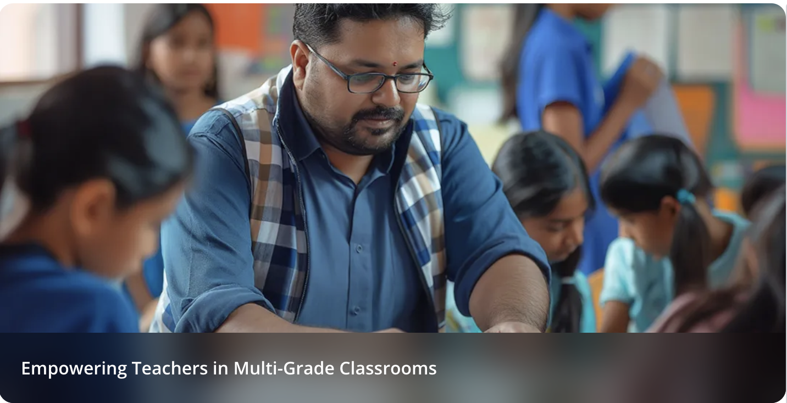

# Sahayak
 Project repo for Google Cloud Agentic AI Day Hackathon: Team CoActiVators

# Activities - July 4th

## Team Assignments
- **Generate Hyper-Local Content**: Priyabrata
- **Create Differentiated Materials (Multimodal)**: Raj
- **Instant Knowledge Base**: Subham
- **Design Visual Aids**: Abhishek

## Think about:
- All constraints + Flow + tech stack + tools + agentic design + Memory
+
- think about Guardrails and cases we need to limit.

## What more to think of:
- Extra Features for the application

# Introduction document
https://docs.google.com/document/d/1v-sD2YkhISmUVdg6NY_q9rUKCrU5Wh6z_t7NISQiE0o/edit?usp=sharing

# Visual aid Generator
https://docs.google.com/document/d/17IGGVdxWTPUEK5PfqqUMAPD3Kd_8Ft5YLRKW59TPGpw/edit?usp=sharing

# Differentiated Materials (Multimodal)
https://www.notion.so/Grade-level-differentiated-materials-2281dd27ff9e801784cac4b976e27bbe?source=copy_link

# Project Overview

## Executive Summary
Sahayak is an innovative AI-powered teaching assistant designed to empower educators, particularly in regions with diverse learning needs and resource constraints. By leveraging advanced Google AI technologies, Sahayak aims to provide personalized, culturally relevant, and accessible learning materials. This report outlines the core features, architectural design, Google technologies utilized, and potential future enhancements for Sahayak.

## Constraints & Assumptions
- **Constraint**: Low resource environment (limited internet, device capabilities)
- **Assumption**: Stable internet connection

## Key Features

### 1. Generate Hyper-Local Content (Priyabrata)
- **Input**: Query in the local language (Audio/text) (e.g., Hindi, Marathi)
- **Output**: Simple, culturally relevant content generated by Gemini, making complex topics relatable to students' lived experiences
- **Format**: WikiHow-style explanation using images
- **Environment**: Home or school setting
- **Example**: [WikiHow Magnesium Guide](https://www.wikihow.com/Which-Magnesium-Is-Best-for-Sleep)

### 2. Create Differentiated Materials (Multimodal) (Raj)
- **Input**: Image of a textbook page + Grade level(s)
- **Output**: Multiple versions of worksheets tailored to different grade levels (beginner, intermediate, advanced)
- **Purpose**: Cater to varied learning paces and comprehension levels within a single classroom
- **Output Formats**: String, JSON/Markdown, DOC/PDF

### 3. Instant Knowledge Base (Subham)
- **Input**: Complex student questions in local language (e.g., "Why is the sky blue?")
- **Output**: Simplified explanations + Easy-to-understand analogies (both in local language)
- **Purpose**: Empower teachers to address student curiosities with clear, digestible information instantly
- **Focus**: Flow + tech stack + tools + agentic design + Memory

### 4. Design Visual Aids (Abhishek)
- **Input**: Description (e.g., "rainfall over 4 months")
- **Output**: Diagram with visual representation
- **Purpose**: Address the need for visual learning tools in resource-limited environments
